# TriviaMania

## Overview

Welcome to Trivia Mania, a web-based trivia quiz application! This project was created to demonstrate proficiency in front-end development, and integration of various technologies to build an engaging and interactive application.

With Trivia Mania, users can enjoy a fun and challenging trivia quiz experience on various topics. It's not just a game; to design, code, and deploy web applications.

## Features

- **User-Friendly Interface**: Trivia Mania offers an intuitive and responsive user interface, ensuring a smooth and enjoyable experience across devices.

- **Rich Trivia Database**: The application leverages an external Open Trivia API to fetch a vast array of trivia questions, ensuring a diverse and extensive quiz database.

- **Custom Quiz Settings**: Users can customize their quiz experience by selecting categories, difficulty levels, question types, and the number of questions.

- **Real-Time Score Tracking**: As users progress through the quiz, they can keep track of their score in real-time, adding an element of competition.

- **Pause and Resume**: Trivia Mania allows users to pause the quiz and resume it later, offering flexibility in playing.

- **Leaderboard**: The application integrates a leaderboard feature that displays the highest scorers, promoting competition and motivation.

## Tech Stack

- **Front-End**: HTML, CSS, JavaScript, React, Redux, Material-UI

- **API Integration**: Fetch questions from Open Trivia DB API

- **State Management**: Redux for state management

- **Database**: Local storage for saving user data

- **Responsive Design**: Ensures a seamless experience across various screen sizes

- **Deployment**: Hosted on [Netlify]

## Usage

To experience Trivia Mania, simply visit [[TriviaMania](https://triviamania.netlify.app/)]. Customize your quiz settings, start playing, and challenge yourself to become the top scorer!

## Setup

To set up and run this project locally, follow these steps:

1. Clone the repository to your local machine.
2. Navigate to the project directory.
3. Install dependencies using `npm install`.
4. Run the development server using `npm start`.
5. Open your web browser and access the application at `http://localhost:3000`.

## Contribution

If you're interested in contributing to Trivia Mania or have suggestions for improvements, please feel free to submit issues or pull requests. Your contributions are highly appreciated.

## Future Enhancements

In the future, I plan to expand and improve Trivia Mania with the following features:

#### User Authentication and Profiles
- Secure user authentication using bcrypt for password hashing.

#### QR Code Game Activation
- Implement QR code scanning to start quiz sessions.
- Convenient and efficient game activation for users.
- Seamless transition into quizzes using QR codes.

#### Enhanced Leaderboards
- Leaderboards for competitive quiz scores.
- Showcasing top performers and their achievements.
- Compete with friends and global players.

#### Additional Game modes

## Contact

Open to collaboration, job opportunities, or any questions you may have. Feel free to reach out!

Thank you for checking out Trivia Mania, and I hope you enjoy your trivia quiz adventure!

---
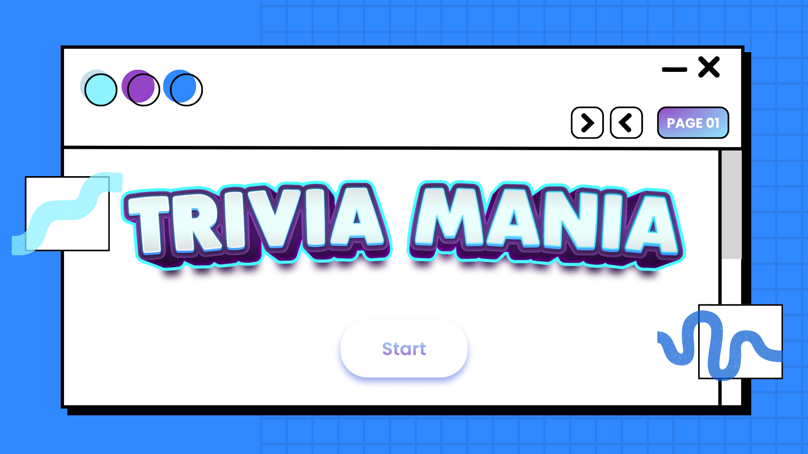 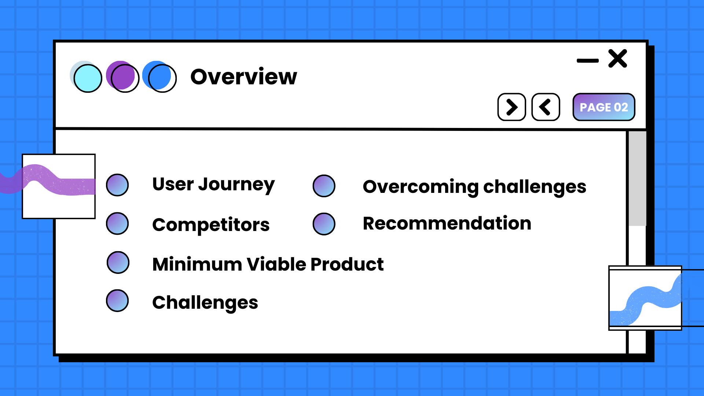 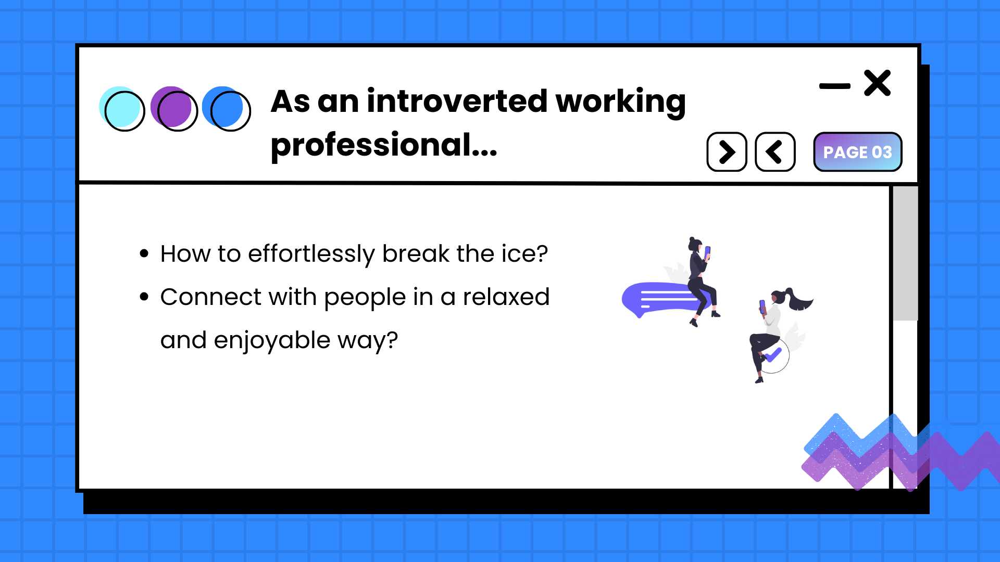 
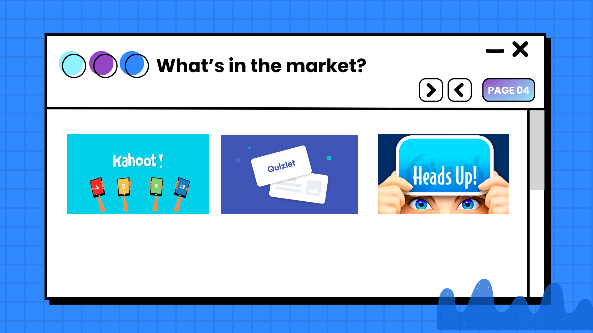 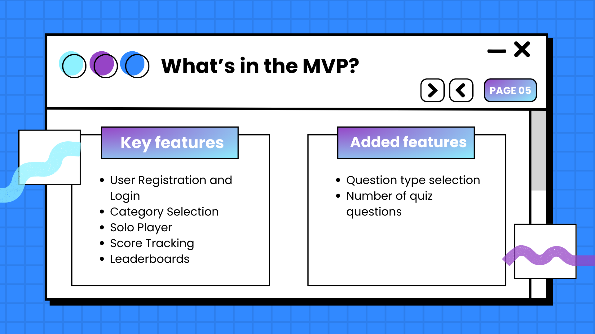 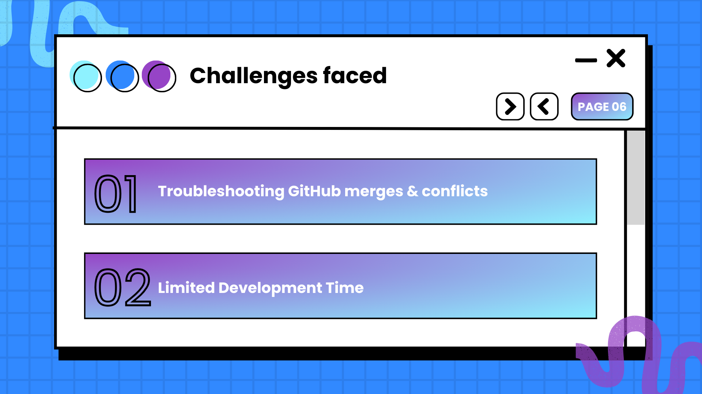 
 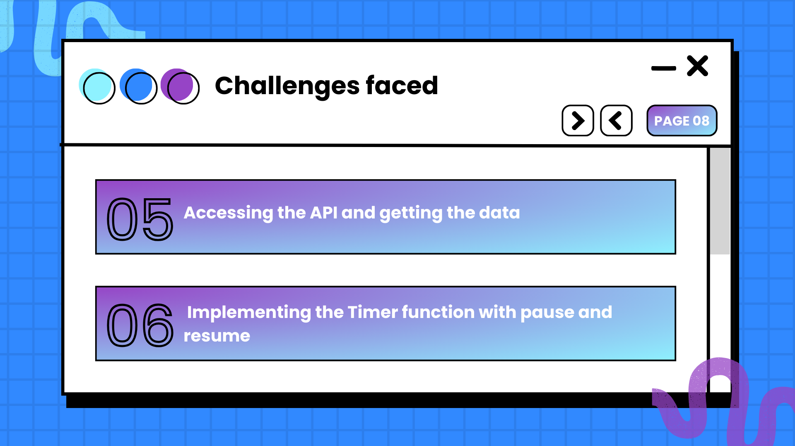 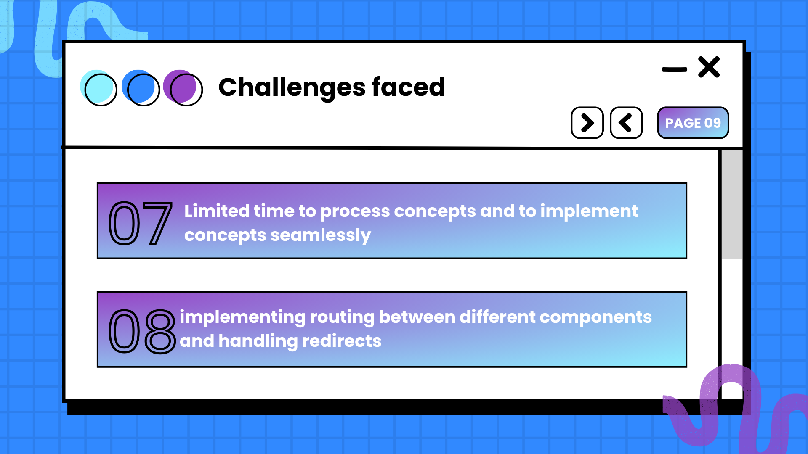
 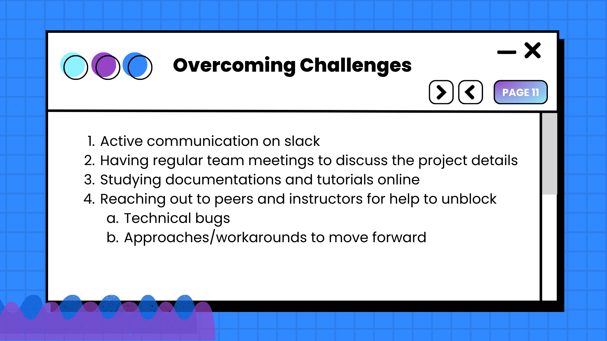 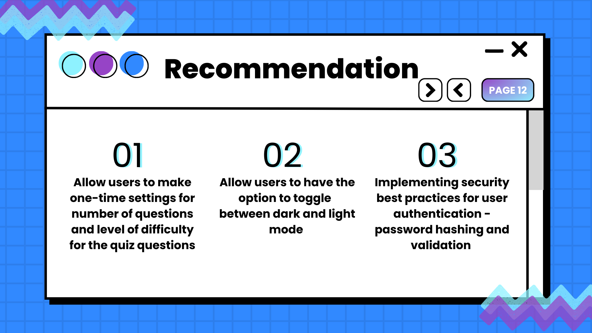 
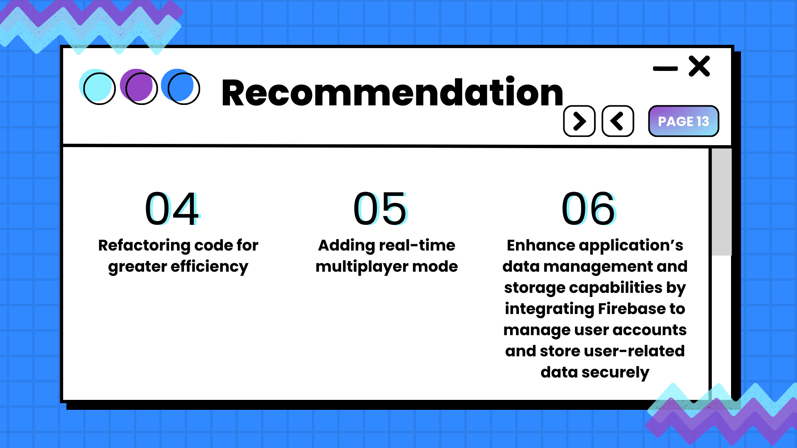 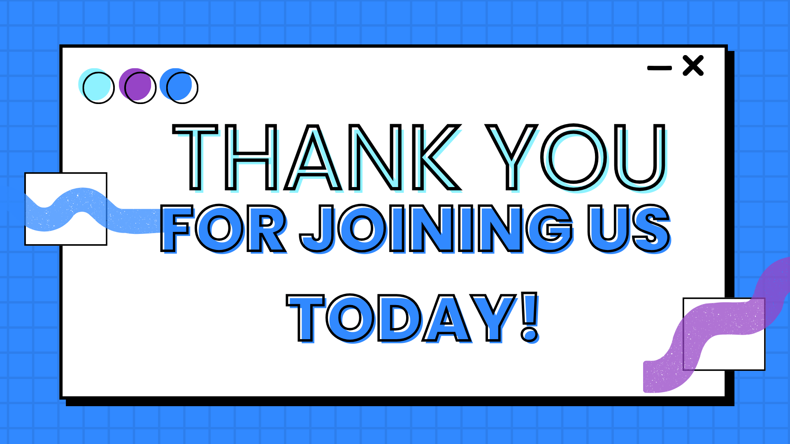   
